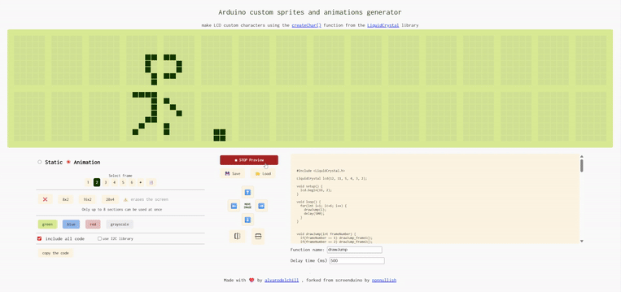
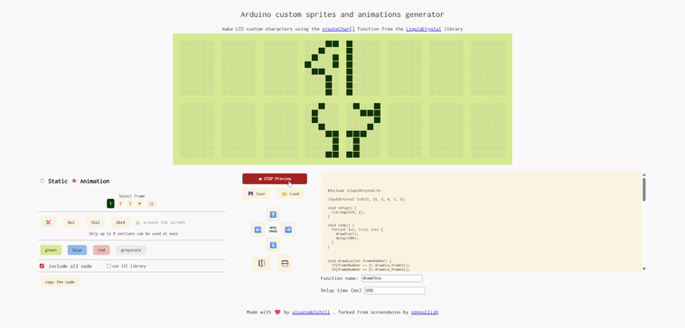

#  custom image and animation generator for arduino screen 
### make LCD custom characters using the createChar() function from the LiquidCrystal library

Forked from [@sometimesdigital](https://github.com/sometimesdigital/screenduino)

- choose the size of your screen
- create glyphs taking up to 8 sections
- automatically generate the code with your custom characters
- create animations frame by frame
- preview the animation 
- save or load your progress
- move or mirror easily all frames, for a more fluid editing
- customize the function name used in the code for better integration in your project
- adjust the timing between frames

### Hardware limitations
- A maximum of 8 vustom characters can be customized. Writing more sections will imply overwrite standard alphanumeric chars
- Code is limited to `MAX_FRAMES = 20`. You can change this value, but be careful with exceeding your Arduino's memory capabilities.

